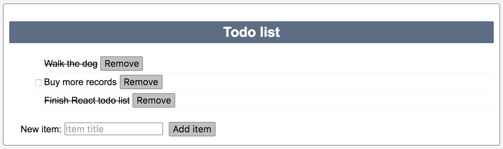

## Todo list

This is a simple example of the true classic, the todo list, written in React/Redux.

### Requirements

`node` and `npm` are expected to be available on the command line in relatively new versions.

### Installing/running

1. Clone the repository
2. Run `npm install`.
3. Start the server with `npm run webpack`.
4. Open the `index.html` file and start being productive!

### Tests

Run tests with `npm test`. Coverage can be found in the `coverage` dir.

Tests have been made for the reducers with full coverage. Tests for the rest of the application have been left unimplemented as an exercise for the reader.
